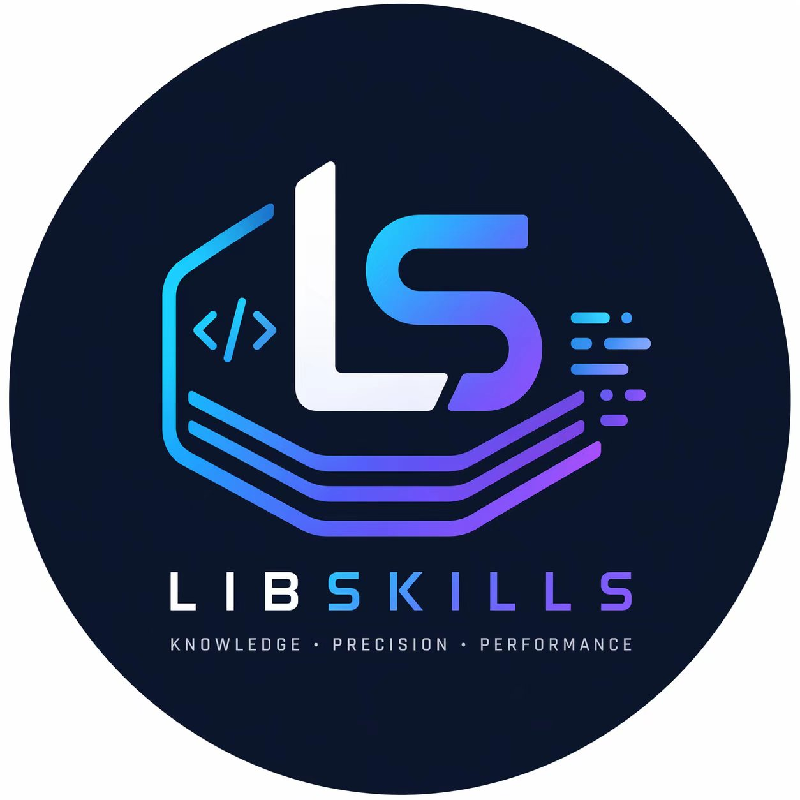

# LibSkills

<p align="center">
  
</p>

**Behavioral Knowledge Layer for Open-Source Libraries.**

Reduce AI hallucinations. Eliminate token waste. Ship best practices out of the box.

LibSkills is a **protocol** — a standard way to package operational knowledge about libraries so that AI agents, IDEs, CI systems, and humans can understand how to use them *safely*.

It answers one question: *"What must an AI agent know to use this library safely?"*

---

## Repositories

| Repository | Description |
|------------|-------------|
| [libskills-schema](https://github.com/LibSkills/libskills-schema) | JSON Schema definitions for skill files |
| [libskills-registry](https://github.com/LibSkills/libskills-registry) | Official skill registry — Tier 1 & Tier 2 knowledge files |
| [libskills-cli](https://github.com/LibSkills/libskills-cli) | Rust CLI — search, get, info, update, init, doctor |
| [libskills-protocol](https://github.com/LibSkills/libskills-protocol) | MCP and HTTP protocol definitions (future) |
| [libskills-docs](https://github.com/LibSkills/libskills-docs) | Philosophy, specification, governance, roadmap |

## Core Loop

```
Discover → Get → Read → Reduce errors
```

## Quickstart

```bash
# Install CLI
cargo install libskills

# Update registry index
libskills update

# Search for a library
libskills search cpp logging

# Download a skill
libskills get cpp/gabime/spdlog

# AI reads and writes correct code on the first try
```

## Governance

| | Main | Contrib |
|--|------|---------|
| **Tier 1** | Official, curated | Official, accepted on merit |
| **Tier 2** | Community-submitted | Community-submitted, any repo |

See [GOVERNANCE.md](./GOVERNANCE.md) for full details.

## License

[Apache 2.0](LICENSE) — LibSkills by [LibSkills Org](https://github.com/LibSkills).
